# 🎵 Music × 🚦 Traffic Dashboard

A real-time dashboard that correlates music trends with traffic data, featuring a balanced mix of Hindi and English music recommendations based on current traffic conditions.

## ✨ Features

- **Real-time Music Data**: Live trending tracks from Last.fm API with 5-10 minute updates
- **Traffic Intelligence**: Smart traffic simulation with city rotation and realistic patterns
- **Multilingual Music**: Balanced Hindi-English music mix with language indicators
- **Traffic-Based Recommendations**: AI-powered music suggestions based on traffic stress levels
- **Playlist Management**: Create, edit, and manage custom playlists
- **Favorites System**: Save and organize your favorite tracks
- **Modern UI**: Responsive design with dark/light theme support
- **Audio Playback**: Working music player with multiple audio sources

## 🚀 Quick Start

### Prerequisites

- Node.js (v16 or higher)
- npm or yarn
- Last.fm API key (free)

### Installation

1. **Clone the repository**
   ```bash
   git clone https://github.com/kumudkode/AIforBharat.git
   cd AIforBharat
   ```

2. **Install dependencies**
   ```bash
   npm install
   ```

3. **Set up environment variables**
   ```bash
   # Copy the example environment file
   cp .env.example .env
   ```

4. **Get your Last.fm API key**
   - Visit [Last.fm API Account Creation](https://www.last.fm/api/account/create)
   - Create a free account and get your API key
   - Open `.env` file and replace `your_lastfm_api_key_here` with your actual API key:
   ```
   VITE_LASTFM_API_KEY=your_actual_api_key_here
   ```

5. **Start the development server**
   ```bash
   npm run dev
   ```

6. **Open your browser**
   - Navigate to `http://localhost:5173`
   - Enjoy the Music × Traffic Dashboard!
   
 ## 📸 Screenshots

### Dashboard Overview
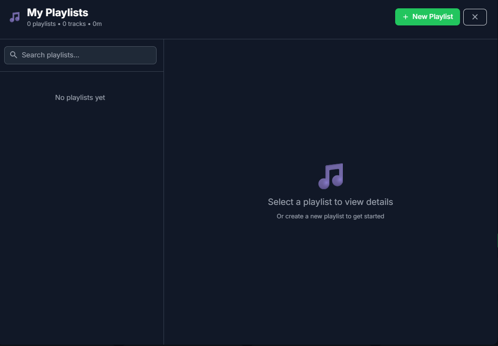


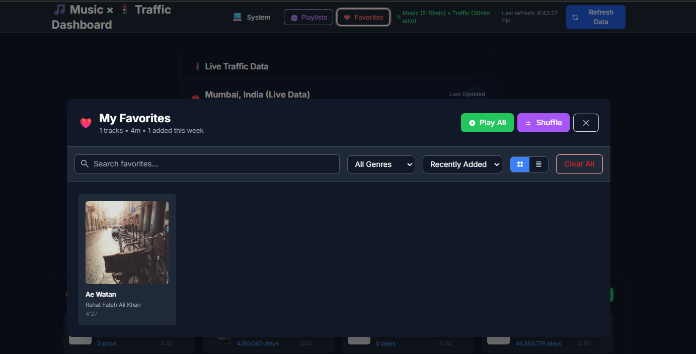

### Traffic Analytics
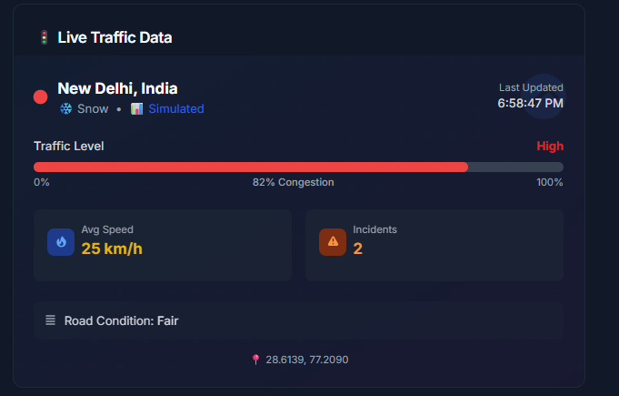

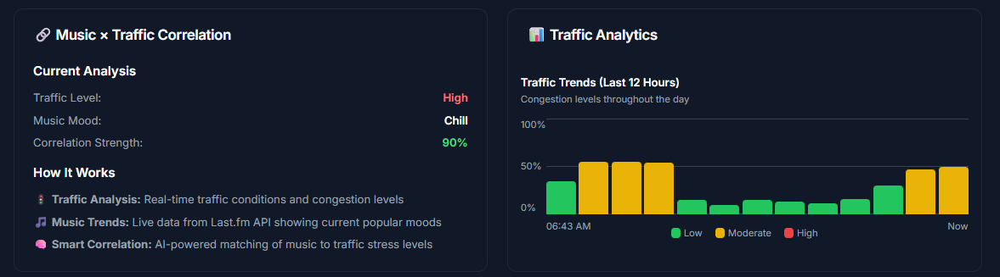

### Trending Music Tracks
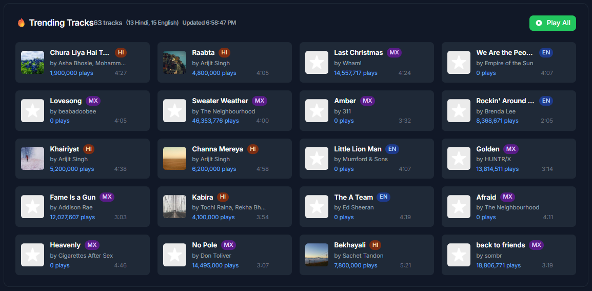
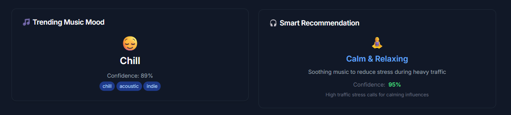

### Live Data Updates
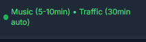

### Theme Support
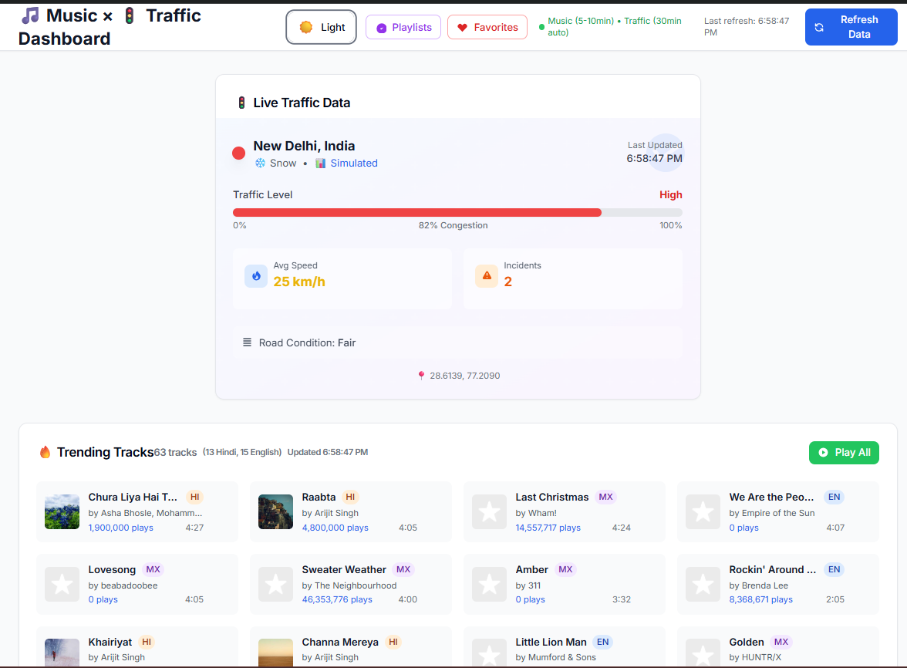
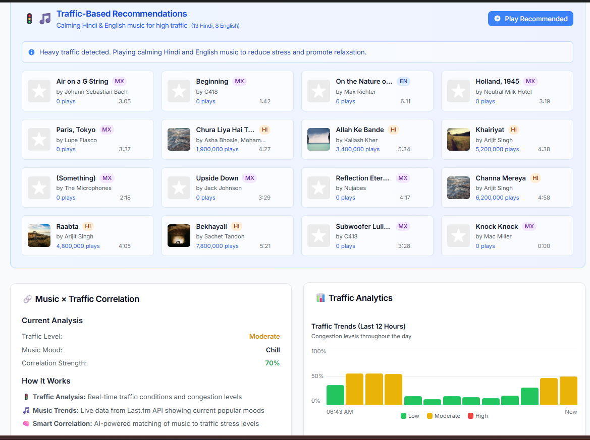

### Music Player Controls
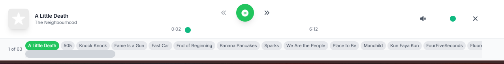
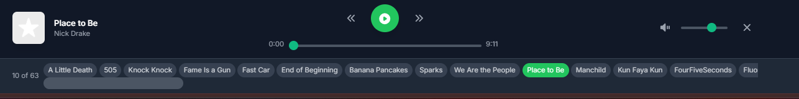


## 🔧 Configuration

### Environment Variables

The application uses the following environment variables:

- `VITE_LASTFM_API_KEY`: Your Last.fm API key for fetching real music data

### API Keys Security

- ✅ The `.env` file is automatically ignored by Git
- ✅ Use `.env.example` as a template for new setups
- ✅ Never commit your actual API keys to version control

## 🎯 How It Works

1. **Music Analysis**: Fetches real-time trending tracks from Last.fm API
2. **Traffic Simulation**: Generates realistic traffic data with city rotation
3. **Smart Correlation**: Matches music moods to traffic stress levels
4. **Balanced Playlists**: Creates 50-50 Hindi-English music mixes
5. **Real-time Updates**: Music updates every 5-10 minutes, traffic every 30 minutes

## 🌍 Supported Cities

The dashboard rotates through major cities including:
- Mumbai, India
- New Delhi, India  
- Bangalore, India
- New York, NY
- Los Angeles, CA
- London, UK
- Tokyo, Japan
- São Paulo, Brazil
- Berlin, Germany
- Sydney, Australia

## 🎵 Music Features

- **Language Support**: Hindi and English tracks with automatic detection
- **Mood-Based Recommendations**: Energetic, Focus, Chill, Upbeat, Relaxing
- **Traffic-Based Suggestions**: Calming music for heavy traffic, energetic for light traffic
- **Playlist Management**: Create and manage custom playlists
- **Favorites System**: Save your favorite tracks
- **Audio Playback**: Working music player with fallback audio sources

## 🚦 Traffic Features

- **Real-time Simulation**: Realistic traffic patterns based on time of day
- **Weather Integration**: Weather conditions affecting traffic
- **City Rotation**: Different cities on each refresh
- **Visual Analytics**: Modern traffic visualization and charts
- **Historical Data**: 24-hour traffic trend analysis

## 🛠️ Tech Stack

- **Frontend**: React 18, TypeScript, Tailwind CSS
- **Animations**: Framer Motion
- **Build Tool**: Vite
- **APIs**: Last.fm API for music data
- **Storage**: Local Storage for playlists and favorites
- **Audio**: HTML5 Audio with SoundHelix demo tracks

## 📱 Responsive Design

The dashboard is fully responsive and works on:
- Desktop computers
- Tablets
- Mobile phones
- Dark and light themes

## 🤝 Contributing

1. Fork the repository
2. Create your feature branch (`git checkout -b feature/amazing-feature`)
3. Commit your changes (`git commit -m 'Add some amazing feature'`)
4. Push to the branch (`git push origin feature/amazing-feature`)
5. Open a Pull Request

## 📄 License

This project is licensed under the MIT License - see the LICENSE file for details.

## 👨‍💻 Author

**Kumud Kode**
- GitHub: [@kumudkode](https://github.com/kumudkode)
- Sponsor: [Support my work](https://github.com/sponsors/kumudkode) ❤️

## 🙏 Acknowledgments

- Last.fm for providing the music API
- SoundHelix for demo audio tracks
- The open-source community for amazing libraries

## 🐛 Troubleshooting

### Common Issues

1. **Music not loading**: Check your Last.fm API key in `.env` file
2. **Audio not playing**: Browser may block autoplay, click play button manually
3. **Build errors**: Make sure all dependencies are installed with `npm install`

### Getting Help

If you encounter any issues:
1. Check the browser console for error messages
2. Verify your `.env` file is properly configured
3. Ensure your Last.fm API key is valid and active

---

Made with ❤️ by [Kumud Kode](https://github.com/kumudkode) for music and traffic enthusiasts!

💖 **Like this project?** [Consider sponsoring me](https://github.com/sponsors/kumudkode) to support more open-source work!